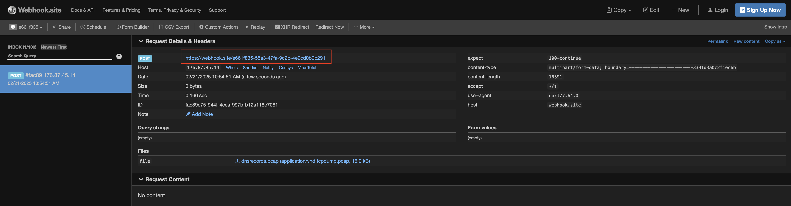

# INTRO

This directory contains a set of useful scripts to collect the DNS names and logs on the CB4 device.

It contains the scripts bellow required for the test.

## SCRIPTS

- `./cb4_install_tcpdump.sh` - install the tcpdump on the CB4 and cleanup after yourself
- `./cb4_start_tcpdump_dns.sh` - set and start the collecting service to store the DNS records into the file
- `./cb4_clean_tcpdump_dns.sh` - cleanup tcpdump service on the cube after the analysis is done

# USAGE

## Install the tcpdump on CB4

```shell
# install the tcpdump software on the CB4
# is a prerequisite for the collecting the dump logs
curl --output cb4_install_tcpdump.sh https://raw.githubusercontent.com/tomislavmiksa/gitScripts/refs/heads/main/cb4_install_tcpdump.sh
chmod +x cb4_install_tcpdump.sh
./cb4_install_tcpdump.sh
```

## Set Collecting service

```shell
# set the collecting service to collect the DNS records in the /tmp folder
curl --output cb4_start_tcpdump.sh https://raw.githubusercontent.com/tomislavmiksa/gitScripts/refs/heads/main/cb4_start_tcpdump_dns.sh
chmod +x cb4_start_tcpdump.sh
./cb4_start_tcpdump.sh
sudo reboot
```

## Verify the service is running

```shell
# after cube comes up verify the service status
# service MUST BE ACTIVE AND RUNNING
systemctl status dnsdebug
● dnsdebug.service - "This service is there to get the DNS requests logs"
     Loaded: loaded (/etc/systemd/system/dnsdebug.service; enabled; vendor preset: enabled)
     Active: active (running) since Fri 2025-02-21 11:37:44 CET; 58s ago
   Main PID: 566612 (tcpdump)
      Tasks: 1 (limit: 9307)
     Memory: 968.0K
        CPU: 4ms
     CGroup: /system.slice/dnsdebug.service
             └─566612 tcpdump -n -w /tmp/dnsrecords.pcap -i any port 53

# let the cube run as much as required
# - if you test the commissioning, complete commissioning
# - if you test some service restart service
```

## Push the logs

- for pushing logs, we are using `https://webhook.site/` web hook 

- it creates a temp web hook to which the small files may be uploaded

- in the example case the webhook created was [ https://webhook.site/e661f835-55a3-47fa-9c2b-4e9cd0b0b291](https://webhook.site/e661f835-55a3-47fa-9c2b-4e9cd0b0b291)
	

- push the data to webhook
	```shell
	cd /tmp
	curl -F 'file=@dnsrecords.pcap' https://webhook.site/e661f835-55a3-47fa-9c2b-4e9cd0b0b291
	```

	


## Cleanup Service and files

```shell
# when completed, clear the cube to stop DNS debugging
curl --output cb4_clean_tcpdump.sh https://raw.githubusercontent.com/tomislavmiksa/gitScripts/refs/heads/main/cb4_clean_tcpdump_dns.sh
chmod +x cb4_clean_tcpdump.sh 
./cb4_clean_tcpdump.sh
sudo rm -rf /tmp/dnsrecords.pcap
```

